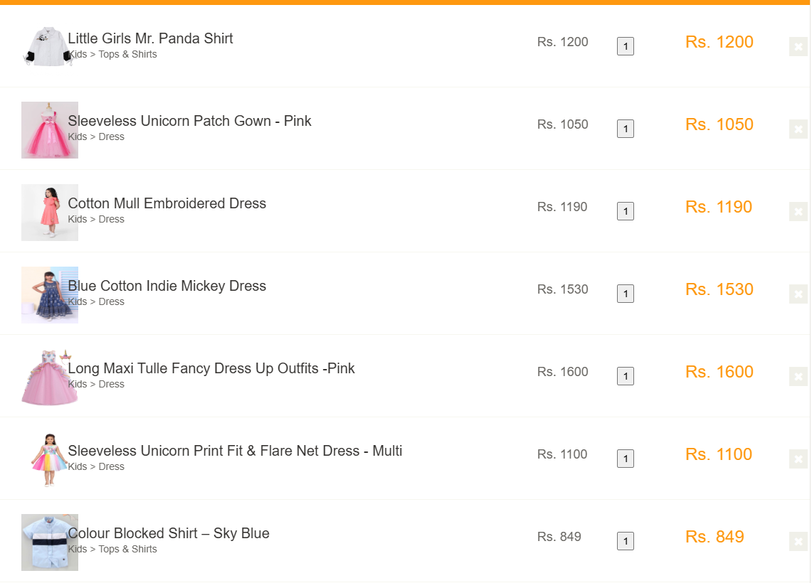

# 📌 QA Automation Challenge - Cypress

---

# 📖 1. Visão do Projeto

Este projeto foi desenvolvido como parte de um desafio técnico para a vaga de **Analista de QA/Teste Pleno**.

O objetivo é validar a qualidade de um fluxo de e-commerce no site Automation Exercise, garantindo cobertura funcional, comportamental e de integração entre UI e API.

A estratégia de testes contempla:

- Validação do fluxo completo de compra com registro durante checkout
- Testes de API com validação de contrato (schema)
- Cenários negativos e edge cases
- Identificação de falhas funcionais e de usabilidade
- Automação escalável com boas práticas de QA

---

# 🛠️ 2. Tecnologias Utilizadas

- Cypress
- JavaScript
- Faker (dados dinâmicos)
- AJV (validação de schema JSON)
- Mochawesome (relatórios de execução)

---

# 📂 3. Estrutura do Projeto

```txt
cypress/
├── e2e/
│   ├── api/
│   │   ├── products.cy.js
│   │   ├── users.cy.js
│   │
│   ├── ui/
│   │   ├── place-order.cy.js
│
├── fixtures/
│
├── pages/
│   ├── cartPage.js
│   ├── homePage.js
│   ├── paymentPage.js
│   ├── signupPage.js
│
├── reports/
├── schemas/
├── support/
│
├── videos/
│   ├── api/
│   ├── ui/
│
assets/
├── bugs/
├── execution/
│
cypress.config.js
package.json
package-lock.json
README.md


⚙️ 4. Instalação do Projeto

1. Instalar dependências

```bash
npm install
```


# ▶️ 5. Execução dos Testes

1. Abrir Cypress em modo interativo

```bash
npx cypress open
```

2. Executar testes em modo headless

```bash
npx cypress run
```


# 🔌 6. Testes de API

GET - All Products List

Valida:

- Status code 200
- Estrutura da resposta via schema (AJV)
- Campos obrigatórios dos produtos
- POST - Create/Register User
- Criação de usuário com dados dinâmicos (Faker)
- Status code de sucesso
- Retorno válido da API
- Evita duplicidade de dados

# 🖥️ 7. UI Automation (E2E Flow)

Fluxo principal: Place Order - Register while Checkout

O teste automatiza o fluxo completo de compra no e-commerce:

Etapas validadas:

- Acesso ao site
- Adição de múltiplos produtos ao carrinho
- Validação de produtos no carrinho
- Início do checkout
- Registro de novo usuário durante o checkout
- Confirmação de conta criada
- Continuidade após login
- Preenchimento de dados de pagamento
- Finalização da compra
- Validação da mensagem "Order Placed!"

# 8. BDD (Fluxo principal)

Feature: Finalização de compra durante checkout

Scenario: Cliente realiza compra criando conta durante o processo
  Given que o cliente adicionou produtos ao carrinho
  When iniciar o processo de checkout
  And realizar um novo cadastro
  And informar os dados de pagamento
  Then o pedido deve ser concluído com sucesso
  And o sistema deve exibir a confirmação da compra

# 🧠 9. Edge Cases (QA Thinking)

1. Carrinho vazio no checkout  
Validar que o sistema impede continuidade sem produtos no carrinho.

2. Sessão expirada durante checkout  
Validar comportamento do sistema quando o usuário perde autenticação no meio da compra.

3. Email duplicado no cadastro  
Garantir que o sistema bloqueia criação de contas com emails já utilizados.

4. Falha no pagamento  
Validar comportamento do sistema quando dados de cartão são inválidos ou incompletos.

5. Mudança de preço antes do checkout  
Validar se o sistema recalcula corretamente o valor final do pedido.

# 🐞 10. Bug Reports

---

# 🐛 Bug 1 — Produto duplicado ao clicar rapidamente em “Add to cart”

## Título
Sistema permite adição duplicada de produto no carrinho ao clicar rapidamente no botão “Add to cart”.

---

## Ambiente

- Site: Automation Exercise
- Navegador: Chrome (Desktop)
- Cenário: Adição de produtos ao carrinho

---

## Descrição

Ao clicar rapidamente múltiplas vezes no botão “Add to cart”, o sistema adiciona diversas unidades do mesmo produto ao carrinho sem qualquer controle de debounce, bloqueio de múltiplos eventos ou prevenção de requisições simultâneas.

---

## Passos para reproduzir

1. Acessar a lista de produtos
2. Selecionar qualquer produto
3. Clicar rapidamente várias vezes em “Add to cart”
4. Abrir o carrinho

---

## Resultado atual

O sistema adiciona múltiplas unidades do mesmo produto proporcionalmente à quantidade de cliques realizados.

---

## Resultado esperado

O sistema deve:

- bloquear múltiplos cliques enquanto a requisição estiver em andamento
OU
- consolidar a ação como apenas 1 adição de produto por interação do usuário

---

## Severidade

**Alta** — Impacta diretamente o fluxo de compra e pode gerar inconsistência no pedido final.

---

## Evidência


---

---

# 🐛 Bug 2 — Quebra de layout no carrinho com múltiplos produtos

## Título

Layout do carrinho quebra e causa sobreposição entre nome do produto e imagem ao adicionar múltiplos itens.

---

## Ambiente

- Site: Automation Exercise
- Navegador: Chrome (Desktop)
- Cenário: Carrinho com múltiplos produtos

---

## Descrição

Ao adicionar vários produtos ao carrinho, o layout da página apresenta problemas de responsividade e alinhamento, causando sobreposição entre elementos visuais como imagem e descrição do produto.

---

## Passos para reproduzir

1. Adicionar 5 ou mais produtos ao carrinho
2. Acessar o carrinho
3. Observar a listagem de produtos

---

## Resultado atual

Os textos dos produtos sobrepõem elementos da interface, comprometendo a legibilidade e experiência do usuário.

---

## Resultado esperado

O layout deve manter espaçamento adequado entre todos os elementos da listagem, garantindo responsividade e legibilidade.

---

## Severidade

**Média** — Impacta usabilidade, experiência do usuário e conferência correta dos itens do pedido.

---

## Evidência



# 📊 11. Boas Práticas Aplicadas

- Separação entre testes de UI e API
- Uso de Page Objects para escalabilidade
- Implementação utilizando Page Object Model (POM)
- Estrutura preparada para escalabilidade e reutilização
- Separação de responsabilidades entre UI e API
- Dados dinâmicos com Faker
- Validação de contrato com AJV
- Uso de assertions para validação de comportamento crítico
- Estrutura organizada para manutenção
- Cenários focados em fluxo real de negócio
- Identificação de edge cases relevantes

# 🚀 12. Conclusão

Este projeto demonstra uma abordagem de QA orientada a risco, cobrindo fluxo crítico de e-commerce, validação de APIs e análise de comportamento do sistema.

O foco principal está na qualidade do produto, não apenas na automação dos testes.
